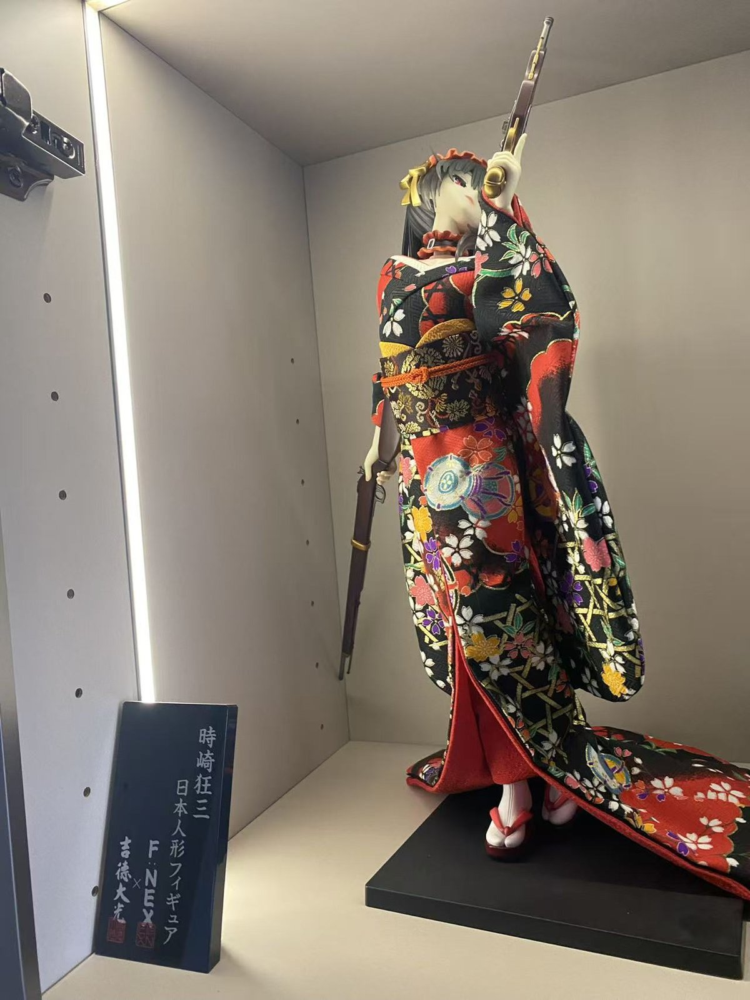

# 藏品素材对照清单（2026-10-07）

> 原片在 `D:\新建文件夹\藏品\`（**没动**）；网站用版本已复制改名压缩到 `code\kurumi-site\images\`（长边 1600px，每张 200~350KB，网页加载无压力）。

## 一、照片 → 网页文件名对照

### 狂三角（镇站主力）
| 原内容 | 网页文件名 | 建议用途 |
|---|---|---|
| 狂三 vs 白发大场景对峙（紫/蓝特效岩石底座）| `kurumi-vs-scene.jpg` | **首屏背景第一候选** |
| F:NEX×吉德大光 1/4 和服狂三（灯柜+铭牌）| `kurumi-kimono-14-fnex.jpg` | 收藏区头图 / 卡片 C 位 |
| 白无垢花嫁 + 恶魔翅膀系 | `kurumi-bride-devils.jpg` | 形态档案区 |
| 万圣狂三（金色钟表底座）+ 女仆 | `kurumi-halloween-clock.jpg` | 形态档案区（钟表=刻刻帝意象，配文可用）|
| 狂三主力柜全景 | `shelf-kurumi-a.jpg` | 整柜实拍 |
| 万圣狂三 + 校服立牌 + 吧唧墙 | `kurumi-halloween-merch.jpg` | 周边墙 |
| 狂三立牌阵（泳装/哥特/粉洋装+生日牌）| `kurumi-standees.jpg` | 周边墙 |

### 游戏系
| 原内容 | 网页文件名 |
|---|---|
| 明日方舟 W（带盒+小手办）| `arknights-w-01.jpg` |
| 明日方舟水墨蓝龙「夕」等大件 | `arknights-dusk.jpg` |
| 碧蓝航线系大件群 | `shelf-azurlane.jpg` |
| 游戏系手办墙 A / B | `shelf-games-a.jpg` / `shelf-games-b.jpg` |
| 四尊大件同柜 | `shelf-bigfour.jpg` |
| 混编柜 | `shelf-mixed.jpg` |
| 初音未来家族墙 | `shelf-miku.jpg` |
| 风纪委员黑长直（+虎斑猫）| `figure-school-cat.jpg` |

### 周边墙
| 原内容 | 网页文件名 |
|---|---|
| 绝区零·星见雅主题墙 | `zzz-miyabi-merch.jpg` |
| 鸣潮·长离/守岸人 | `wuwa-changli-merch.jpg` |

## 二、HTML 里怎么引用（相对路径）

```html

```
**注意**：`images/` 和 `index.html` 同级时就这么写；移动 HTML 文件位置时路径要跟着改（这是"图裂"的头号原因）。

## 三、重拍建议（进阶，可选）

现在的照片"能用"，但有三处可提升：①隔着柜玻璃拍有反光——关灯拍或贴着玻璃拍；②部分照片俯角大——**镜头平视**手办更挺拔；③首屏那张大场景值得单独竖拍一张（竖图做手机端背景更好用）。不重拍也能开工，别让素材阻塞写码。

## 四、待补信息（建卡片前填好）

- [ ] 每尊手办的**准确名字/版本/厂商**（我不乱认的，按你的记录填：如"F:NEX × 吉德大光 1/4 和服"）
- [ ] 每件的**入手故事**一句话（哪年、为什么入）——这是"你和她"的部分
- [ ] 图源声明放页脚："藏品实拍，图源网络，仅学习交流"
